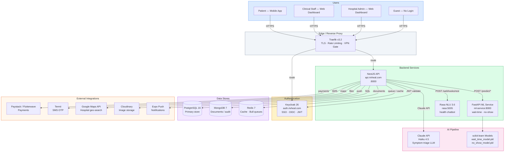

# RivHeal System Architecture

> Last updated: **2026-05-30**

---

<!-- AUTO-GENERATED: architecture-diagram-start -->

## High-Level Architecture



<!-- AUTO-GENERATED: architecture-diagram-end -->

---

<!-- AUTO-GENERATED: component-descriptions-start -->

## Component Descriptions

### NestJS API (`rivheal-api`)
- **Role:** Core business logic for all EMR operations and AI feature orchestration.
- **Port:** `8000` (internal), exposed via Traefik at `api.rivheal.com`.
- **Global prefix:** `/api` · **Versioning:** URI-based (`/api/v1/...`).
- **Auth strategy:** JWT (HS256) issued by the API itself + Keycloak OIDC for SSO. Dual-lookup JWT strategy supports both simultaneously.
- **Multi-tenancy:** Every entity scoped by `hospitalId` + `branchId`. The `X-Hospital-Id` and `X-Branch-Id` headers are required on admin endpoints.
- **Key framework features:** NestJS global guards, `@Public()` decorator for open endpoints, `@Roles()` for RBAC, Bull queues for async jobs, `@Cron` for scheduled tasks.

### React Admin Dashboard (`rivheal-frontend`)
- **Role:** Clinical and administrative interface for hospital staff.
- **Stack:** React 19, Vite, TanStack Query v5, Tailwind CSS, React Hook Form.
- **Auth:** JWT + Keycloak. Multi-branch switcher stores context in Zustand.
- **API communication:** Axios with hospital/branch header injection.

### Expo Mobile App (`rivheal-mobile-app`)
- **Role:** Patient-facing app for appointment booking, symptom checking, wellness tracking, telemedicine, and more.
- **Stack:** Expo SDK 56, React Native 0.85, NativeWind v4, TanStack Query v5.
- **Offline:** WatermelonDB (SQLite via JSI) stores symptom history and wellness metrics locally. MMKV for fast key-value (auth cache, guest session ID).
- **Auth:** JWT with SecureStore for token persistence. Guest session support via `guestSessionId` in MMKV.
- **Real-time:** Socket.io-client on `/queue` namespace for live queue updates.

### FastAPI ML Service (`rivheal-ml-service`)
- **Role:** Serves scikit-learn predictions for wait-time and no-show probability.
- **Port:** `8000` (internal only, not Traefik-routed in prod).
- **Models:** GradientBoosting models loaded from `models/*.pkl`. Falls back to rule-based estimates when models are not yet trained.
- **Called by:** NestJS `MlProxyService` with 5-second timeout and graceful fallback.

### Rasa Bot (`rasa-bot`)
- **Role:** NLU health assistant chatbot supporting English + Nigerian Pidgin + 4 other languages.
- **Port:** `5005` (Rasa) + `5055` (actions server).
- **Called by:** NestJS `RasaService` proxying patient messages to Rasa's REST webhook.
- **Fallback:** If Rasa is unavailable, the API returns a 503. The mobile app surfaces a friendly error.

### Keycloak (`auth.rivheal.com`)
- **Role:** SSO and OIDC provider. Manages realm-level users, roles, and clients.
- **Realm:** `rivheal` — pre-imported from `rivheal-infra/keycloak/realm-export.json`.
- **Clients:** `api-server` (confidential, for API), `rivheal-web` (public, for SPA), `mobile-app` (PKCE, for Expo).

### Traefik (`rivheal-infra`)
- **Role:** Reverse proxy, TLS termination (Let's Encrypt), rate limiting, VPN gating for admin routes.
- **Dynamic config:** `traefik/dynamic.yml` defines rate-limit, security-header, and VPN-only middlewares.

<!-- AUTO-GENERATED: component-descriptions-end -->

---

<!-- AUTO-GENERATED: feature-flags-start -->

## Feature Flags — AI/ML Toggle

All AI features are controlled by two-level feature flags:

### Global Flag
```bash
ENABLE_AI_FEATURES=true   # set in .env / docker-compose
```
When `false`, all `/predict/*`, `/patients/:id/health-score`, and Claude LLM calls return fallback values or `403`.

### Per-Tenant Flag
Column `hospitals.ai_features_enabled` (boolean, default `false`).

The `FeatureFlagsService` (global NestJS module) checks both:
```typescript
const enabled = await featureFlagsService.isAiEnabled(hospitalId);
// false if ENABLE_AI_FEATURES=false OR hospital.ai_features_enabled=false
```

Enable per hospital via the admin API or direct DB update:
```sql
UPDATE hospitals SET ai_features_enabled = true WHERE id = '<hospital-uuid>';
```

<!-- AUTO-GENERATED: feature-flags-end -->

---

## Data Flow — Appointment Booking

See [flows/appointment-booking.md](./flows/appointment-booking.md) for the full sequence diagram.

## Data Flow — AI Triage

See [flows/symptom-checker-llm.md](./flows/symptom-checker-llm.md).
