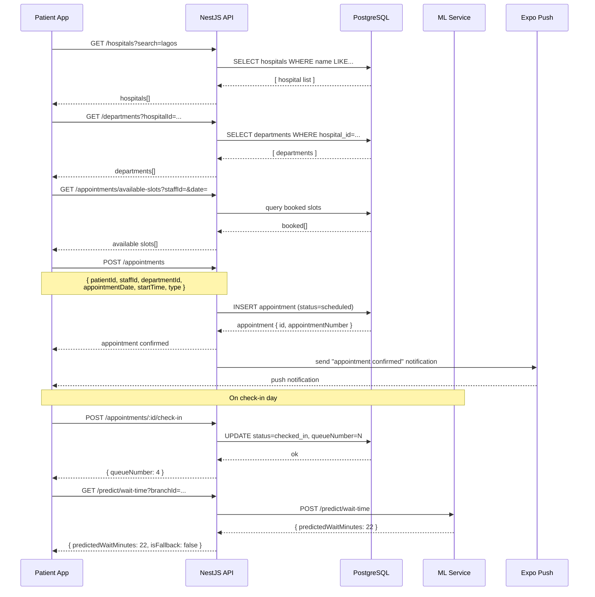

# Flow: Appointment Booking

> Last updated: **2026-05-30**

---



---

## Key Entities

| Entity | Table | Key Fields |
|---|---|---|
| Appointment | `appointments` | `status`, `queueNumber`, `checkedInAt`, `consultationStartedAt`, `actualWaitMinutes` |
| Patient | `patients` | `userId`, `patientId`, `hospitalId` |
| Staff | `staff` | `isBookable`, `staffId` |

## Status Lifecycle

```
scheduled → confirmed → checked_in → in_progress → completed
                     ↘ cancelled
                     ↘ no_show
                     ↘ rescheduled
```

## Notes

- Slot availability is checked in real time — concurrent bookings cannot claim the same slot (conflict detection in `AppointmentRepository.findOverlappingSlot`).
- `actualWaitMinutes` is computed automatically when `completeConsultation()` is called: `consultationStartedAt - checkedInAt`.
- The ML wait-time prediction uses `queue_snapshots` data (captured every 15 min by a cron job) as training features.
