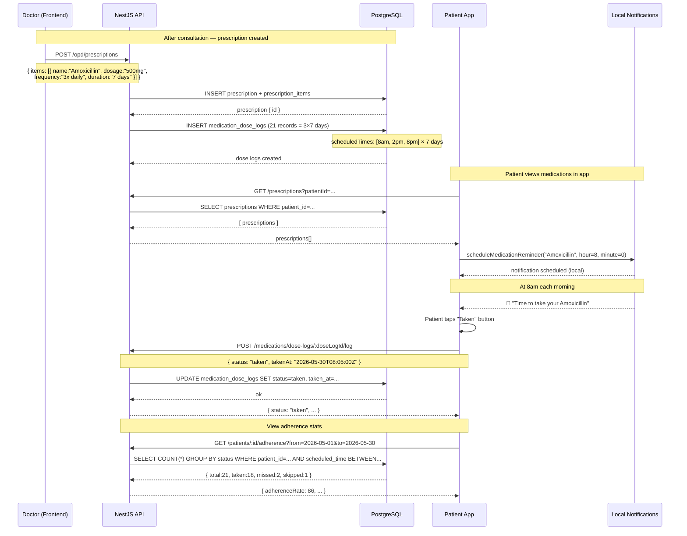

# Flow: Medication Adherence Tracking

> Last updated: **2026-05-30**

---



---

## Dose Status Lifecycle

```
pending → taken     (patient marks as taken)
        → skipped   (patient consciously skips)
        → missed    (no action by next scheduled dose)
```

## Key Endpoints

| Method | Path | Description |
|---|---|---|
| `POST` | `/medications/dose-logs/:id/log` | Log a dose (taken/skipped/missed) |
| `GET` | `/medications/prescriptions/:id/dose-logs` | Dose schedule for a prescription |
| `GET` | `/patients/:id/adherence?from=&to=` | Adherence stats over date range |

## Scheduled Hours

| Frequency | Times |
|---|---|
| Once daily (1×) | 8:00 |
| Twice daily (2×) | 8:00, 20:00 |
| Three times daily (3×) | 8:00, 14:00, 20:00 |
| Four times daily (4×) | 8:00, 12:00, 16:00, 20:00 |
