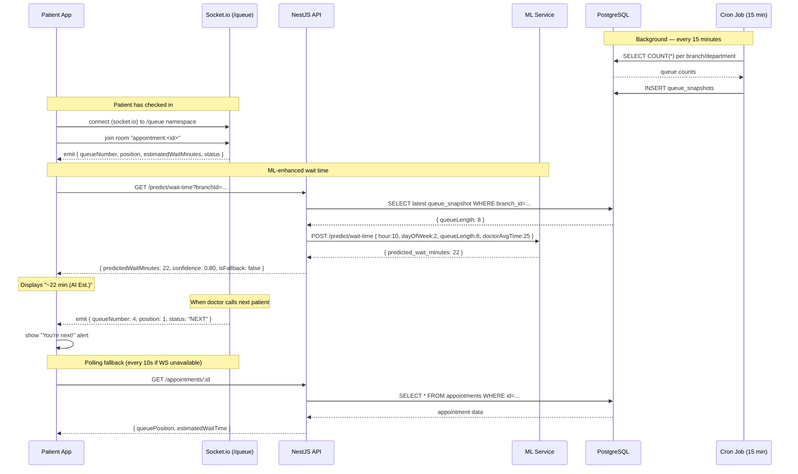

# Flow: Real-time Queue Tracking

> Last updated: **2026-05-30**

---

---

## Socket.io Events

| Event | Direction | Payload |
|---|---|---|
| `queue:update` | Server → Client | `{ queueNumber, currentNumber, position, estimatedWaitMinutes, status }` |
| `queue:called` | Server → Client | `{ message: "Your turn!" }` |
| `join-queue` | Client → Server | `{ appointmentId }` |

## Fallback Strategy

1. **Primary:** Socket.io real-time updates via `/queue` namespace.
2. **Secondary:** ML-predicted wait time from `GET /predict/wait-time` (polled every 3 min).
3. **Tertiary:** `appointment.estimatedWaitTime` field from REST polling every 10s.

If ML service is unreachable → `isFallback: true` → display socket or static estimate.
