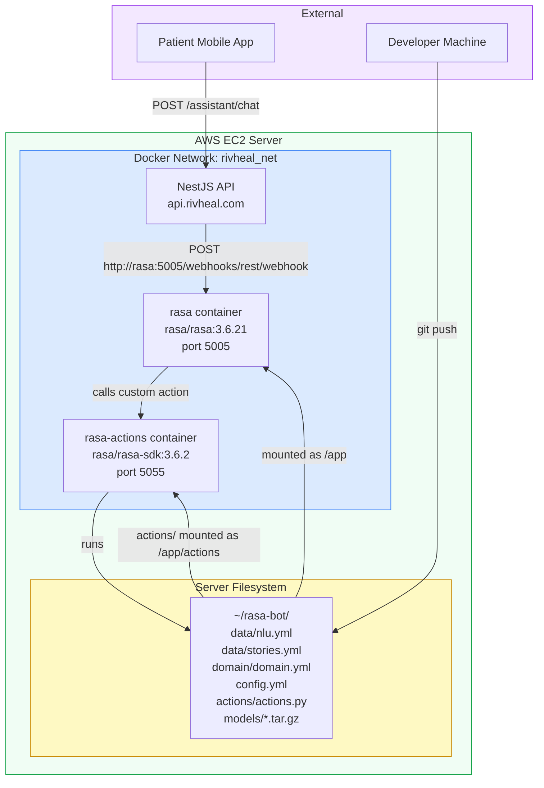
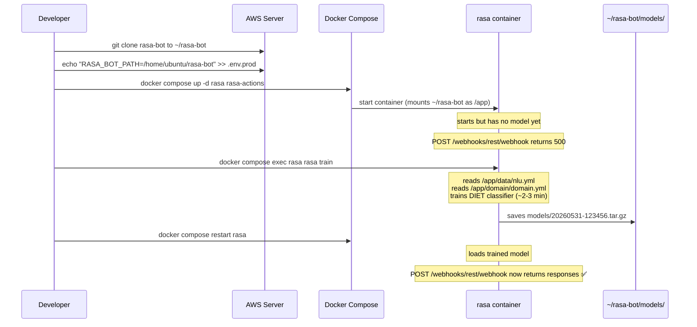
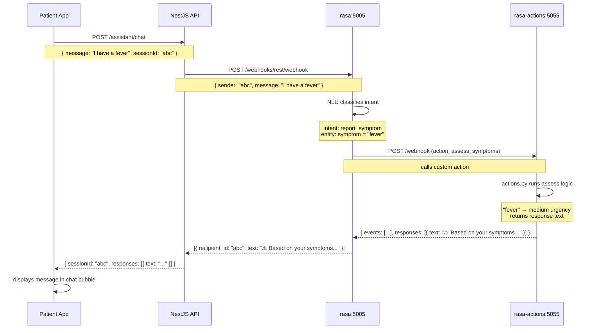
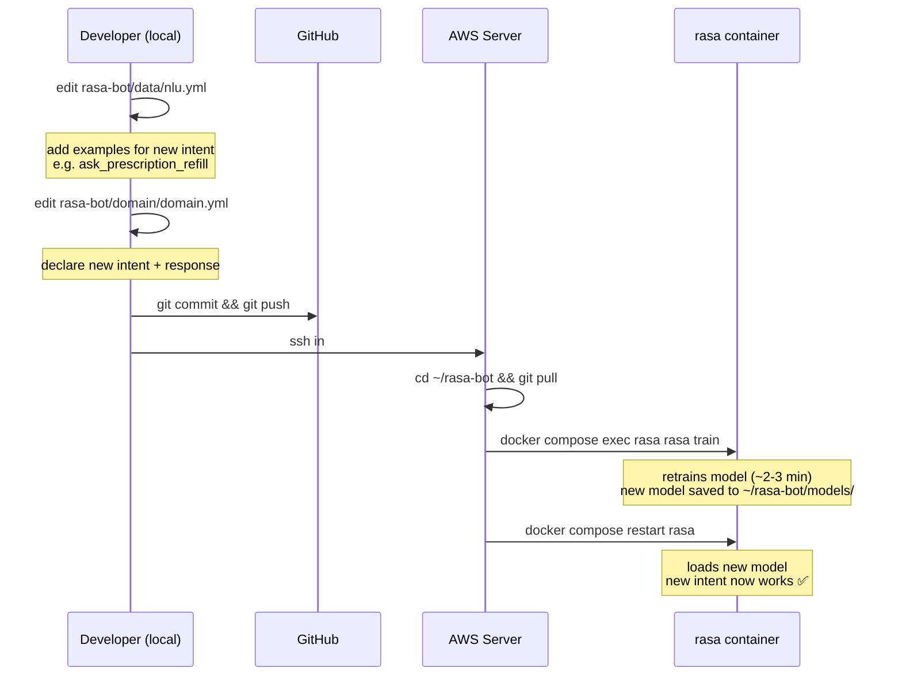
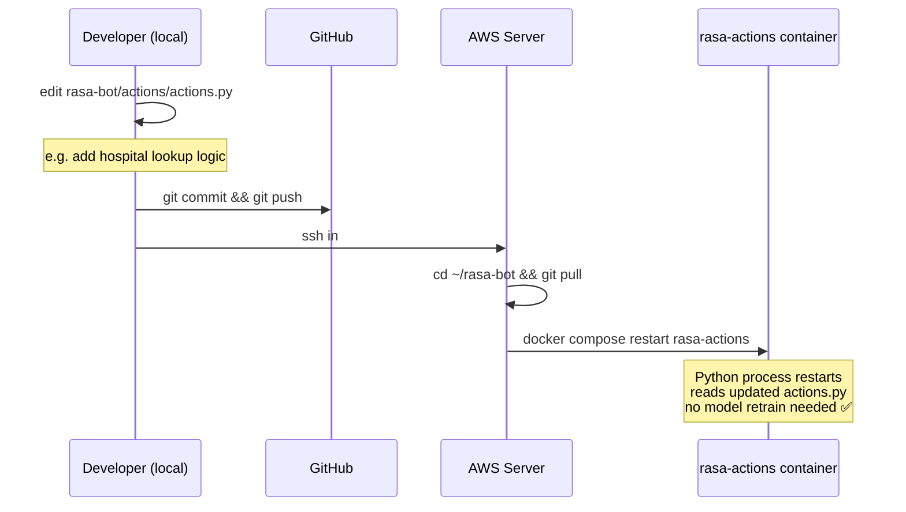

# Flow: Rasa Chatbot — Deployment, Training & Message Handling

> Last updated: **2026-05-31**

---

## The Three Things Rasa Needs to Work

```
1. rasa-bot/ folder    ← your code (intents, stories, actions)
2. Trained model       ← output of `rasa train`, saved to rasa-bot/models/
3. Running containers  ← rasa + rasa-actions, both reading from rasa-bot/
```

All three must be present. The most common failure is having #1 and #3 but not #2 — rasa starts but every message returns an error.

---

## Architecture: How rasa-bot connects to everything



---

## Flow: First-Time Deploy



---

## Flow: Patient Sends a Chat Message



---

## Flow: Updating the Bot (adding new intents)



---

## Flow: Updating Custom Actions Only (no retrain needed)



---

## What's in Each File

### `data/nlu.yml` — Training Examples
```yaml
- intent: report_symptom
  examples: |
    - I have [fever](symptom)
    - body dey pain me         ← Nigerian Pidgin
    - I'm experiencing [chest pain](symptom)
```
More examples = more accurate intent detection. Add at least 10 per intent.

### `domain/domain.yml` — Bot Vocabulary
```yaml
intents:
  - report_symptom
  - book_appointment
  - emergency

responses:
  utter_emergency:
    - text: "🚨 Call 999 immediately!"

actions:
  - action_assess_symptoms    ← must match a class name in actions.py
```

### `actions/actions.py` — Custom Logic
```python
class ActionAssessSymptoms(Action):
    def name(self): return "action_assess_symptoms"

    def run(self, dispatcher, tracker, domain):
        symptoms = tracker.get_slot("symptoms") or []
        # ... triage logic ...
        dispatcher.utter_message(text="Based on your symptoms...")
        return []
```

### `config.yml` — Model Configuration
Controls which ML algorithms Rasa uses. The default DIET classifier + TEDPolicy is appropriate for MVP. No changes needed unless you're tuning accuracy.

---

## Troubleshooting

| Symptom | Cause | Fix |
|---|---|---|
| `rasa` container keeps restarting | No model trained yet | `docker compose exec rasa rasa train` |
| `POST /webhooks/rest/webhook` returns `{"version":"3.6.21"}` but no response | Model loaded but no matching intent | Add more training examples to `nlu.yml`, retrain |
| `rasa-actions` container exits immediately | Syntax error in `actions.py` | `docker compose logs rasa-actions` to see error |
| API returns `"AI assistant is temporarily unavailable"` | `rasa` container not running or `RASA_SERVER_URL` wrong | Check `docker compose ps rasa`, verify `RASA_SERVER_URL=http://rasa:5005` |
| New intent not being recognised | Retrained but model not loaded | `docker compose restart rasa` after train |
| `RASA_BOT_PATH` not set | Compose can't mount the volume | Add `RASA_BOT_PATH=/home/ubuntu/rasa-bot` to `.env.prod` |
