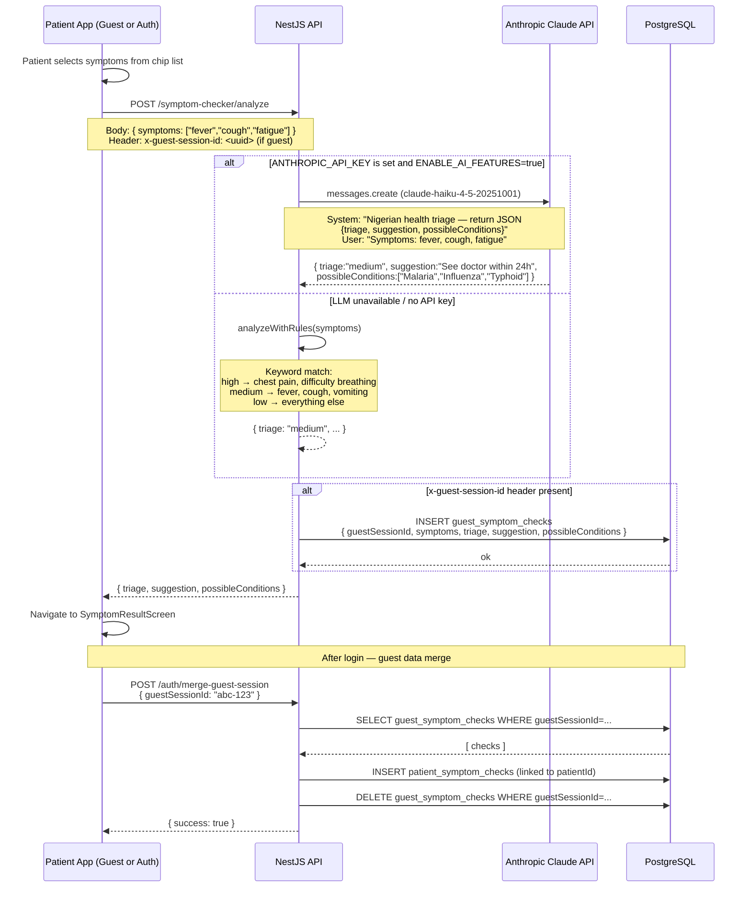

# Flow: Symptom Checker + Claude LLM Triage

> Last updated: **2026-05-30**

---



---

## Triage Levels

| Level | Color | Advice | Example Symptoms |
|---|---|---|---|
| `high` | 🔴 Red | Seek urgent care immediately | chest pain, difficulty breathing, severe headache |
| `medium` | 🟡 Amber | Consult a doctor within 24 hours | fever, cough, vomiting, fatigue |
| `low` | 🟢 Green | Monitor at home | mild sore throat, runny nose |

## Claude Prompt Design

```typescript
system: `You are a Nigerian health triage assistant. Given a list of symptoms, 
return a JSON object with:
- triage: "low" | "medium" | "high"
- suggestion: string (actionable advice in plain English)
- possibleConditions: string[] (2-4 likely conditions, include tropical diseases 
  relevant in Nigeria)

Return ONLY valid JSON, no markdown.`

user: `Symptoms: fever, cough, fatigue`
```

## Feature Flag

- Requires `ENABLE_AI_FEATURES=true` AND `ANTHROPIC_API_KEY` to be set.
- Without both, the rule-based engine runs silently (no error returned to client).
- Mobile and admin UIs receive the same response shape regardless of engine used.

## Data Tables

| Table | Purpose |
|---|---|
| `guest_symptom_checks` | Stores triage results for unauthenticated users |
| `patient_symptom_checks` | Stores triage results after merge to authenticated patient |
