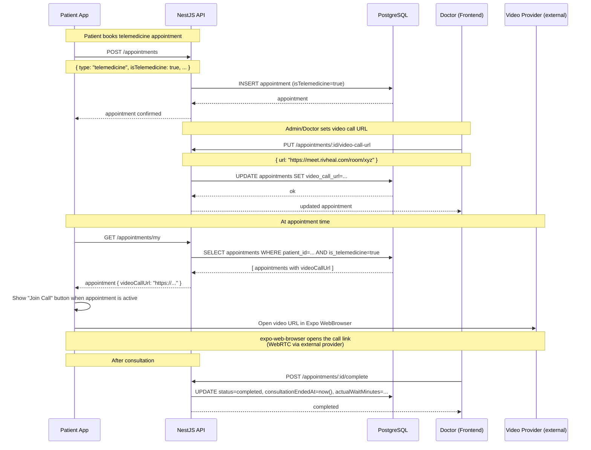

# Flow: Telemedicine (Video Consultation)

> Last updated: **2026-05-30**

---

---

## Current State

- **Booking:** ✅ — `isTelemedicine: true` on appointment creation.
- **Video URL:** ✅ — Staff sets URL via `PUT /appointments/:id/video-call-url`.
- **Join flow:** ✅ (basic) — `TelemedicineScreen` exists; video URL displayed.
- **Integrated WebRTC:** ❌ Planned — no embedded video SDK yet (Daily.co / Agora / 100ms).
- **Recording:** ❌ Planned.

## Required Env Vars (when video SDK is added)

| Variable | Description |
|---|---|
| `VIDEO_PROVIDER_API_KEY` | API key for WebRTC provider |
| `VIDEO_ROOM_PREFIX` | Room name prefix (e.g., `rivheal-`) |
